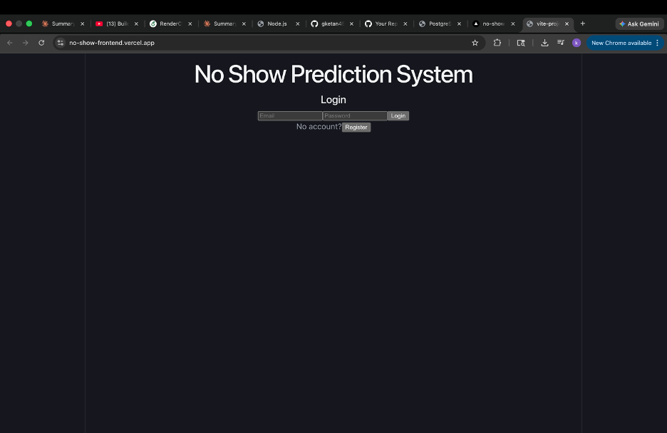
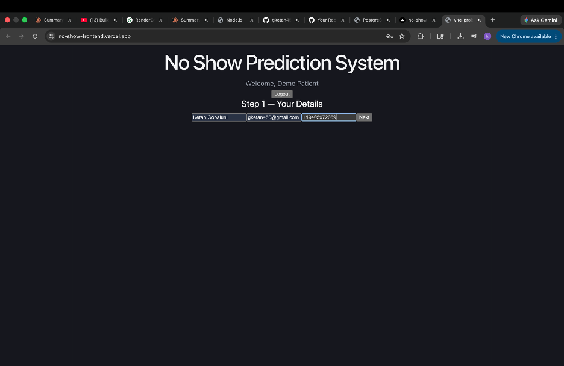
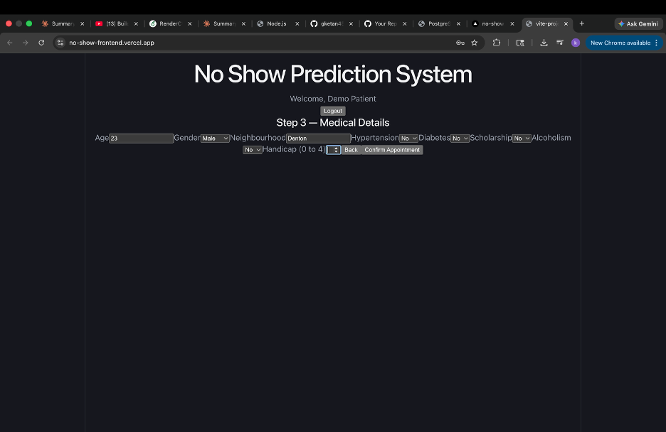
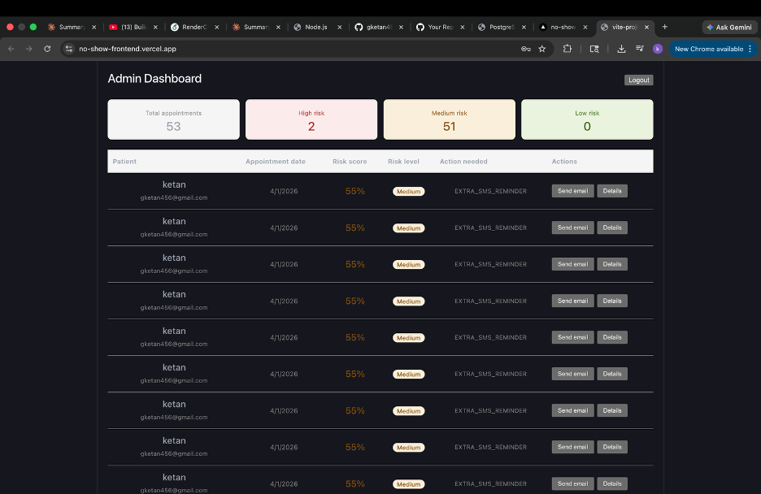

# 🏥 Healthcare No-Show Prediction System


> An end-to-end AI-powered healthcare platform that predicts patient no-show probability using machine learning, automates risk-based notifications, and provides hospital staff with real-time insights through an admin dashboard.

## 🔴 Live Demo

**[https://no-show-frontend.vercel.app](https://no-show-frontend.vercel.app)**

| Role    | Email                        | Password |
|---------|------------------------------|----------|
| Patient | demo@patient.com             | demo123  |
| Admin   | admin@noshowplatform.com     | admin123 |

---
## 📸 Screenshots

### Login


### Step 1 — Patient Details


### Step 2 — Appointment Date


### Step 3 — Medical Details


### Admin Dashboard


---


## 🎯 The Problem This Solves

Healthcare no-shows cost the US healthcare system **$150 billion annually**. When patients miss appointments, it wastes clinical resources, delays care for other patients, and reduces hospital revenue.

This system uses ML to predict which patients are at risk of missing their appointment — before it happens — so staff can intervene proactively.

---

## ✨ Key Features

### Patient Portal
- Multi-step appointment booking (name → date → medical details)
- Automatic risk assessment after booking
- Email confirmation with personalized messaging based on risk level

### ML Prediction Engine
- Logistic Regression model trained on **110,000+ real patient records**
- 15 engineered features including lead time, neighbourhood frequency mapping, age group classification
- Three risk tiers: High (>70%), Medium (50-70%), Low (<50%)
- Automated risk-based actions: call center outreach, extra reminders, standard confirmation

### Admin Dashboard
- Real-time view of all appointments with ML risk scores
- Color-coded risk levels (High/Medium/Low)
- One-click email reminders to high-risk patients
- Detailed patient modal with full medical history and prediction details
- Summary stats: total appointments, high/medium/low risk counts

### Security
- JWT authentication with role-based access control
- Patients see only booking flow
- Staff see full dashboard with predictions
- Passwords hashed with bcrypt

---

## 🏗️ System Architecture

```
┌─────────────────┐     ┌──────────────────┐     ┌─────────────────────┐
│                 │     │                  │     │                     │
│  React Frontend │────▶│  Node.js Backend │────▶│  Python FastAPI     │
│  (Vercel)       │     │  (Render)        │     │  ML Service         │
│                 │◀────│                  │◀────│  (Render)           │
└─────────────────┘     └────────┬─────────┘     └─────────────────────┘
                                 │
                                 ▼
                        ┌──────────────────┐     ┌─────────────────────┐
                        │                  │     │                     │
                        │  PostgreSQL      │     │  SendGrid           │
                        │  (Neon)          │     │  Email API          │
                        │                  │     │                     │
                        └──────────────────┘     └─────────────────────┘
```

---

## 🛠️ Tech Stack

| Layer | Technology |
|-------|-----------|
| Frontend | React.js, Vite, Axios |
| Backend | Node.js, Express.js, JWT, MVC Architecture |
| ML Service | Python, FastAPI, scikit-learn, pandas |
| Database | PostgreSQL (Neon cloud) |
| Email | SendGrid API |
| SMS | Twilio API |
| Deployment | Vercel (frontend), Render (backend + ML), Neon (DB) |

---

## 🤖 ML Model Details

```
Dataset:    Kaggle Medical Appointment No-Shows
Records:    110,000+ patient appointments
Algorithm:  Logistic Regression (class_weight=balanced)
Threshold:  0.7 for high risk classification
```

**Feature Engineering:**
| Raw Input | Engineered Feature |
|-----------|-------------------|
| Scheduled + Appointment date | lead_time_days |
| Appointment date | appointment_dayofweek, appointment_weekend |
| Neighbourhood (text) | neighbourhood_freq (frequency encoding) |
| Age (number) | age_group_YoungAdult/Adult/MiddleAged/Senior |
| Handcap (0-4) | handcap_bin (binarized) |

---

## 📁 Project Structure

```
no-show-platform/
├── backend/                  # Node.js REST API
│   └── src/
│       ├── controllers/      # Request handlers
│       ├── services/         # Business logic + DB queries
│       ├── routes/           # API route definitions
│       ├── middlewares/      # JWT auth, error handler
│       ├── db/               # Table creation
│       └── config/           # Database connection
├── frontend/                 # React + Vite
│   └── src/
│       ├── pages/            # Step1, Step2, Step3, Step4, Admin, Auth
│       └── services/         # Axios API client
└── ml/                       # Python FastAPI ML service
    ├── main.py               # FastAPI app + prediction endpoint
    └── artifacts/            # Trained model + feature files
```

---

## 🚀 Running Locally

### Prerequisites
- Node.js 18+
- Python 3.11+
- PostgreSQL

### Backend
```bash
cd backend
npm install
cp .env.example .env   # fill in your values
npm start
# runs on http://localhost:5001
```

### Frontend
```bash
cd frontend
npm install
npm run dev
# runs on http://localhost:5173
```

### ML Service
```bash
cd ml
python3 -m venv venv
source venv/bin/activate
pip install -r requirements.txt
uvicorn main:app --reload --port 8000
# runs on http://localhost:8000
```

---

## 🔑 Environment Variables

### backend/.env
```env
PORT=5001
DATABASE_URL=postgresql://...
JWT_SECRET=your_secret_here
JWT_EXPIRES_IN=7d
ML_SERVICE_URL=http://localhost:8000
SENDGRID_API_KEY=SG.xxx
SENDGRID_FROM_EMAIL=your@email.com
TWILIO_ACCOUNT_SID=ACxxx
TWILIO_AUTH_TOKEN=xxx
TWILIO_PHONE_NUMBER=+1xxx
```

---

## 📡 API Reference

### Authentication
```
POST /api/auth/register   Register new user
POST /api/auth/login      Login and get JWT token
```

### Patient Booking (requires auth)
```
POST /api/patients              Create patient profile
POST /api/appointments          Book appointment
POST /api/predictions           Run ML prediction + send email
```

### Admin (requires admin role)
```
GET  /api/admin/appointments    All appointments with predictions
POST /api/admin/send-reminder   Send email reminder to patient
```

---

## 📊 Database Schema

```sql
users         — id, name, email, password_hash, role
patients      — id, full_name, email, phone, age, gender,
                neighbourhood, hypertension, diabetes,
                scholarship, alcoholism, handicap
appointments  — id, patient_id (FK), scheduled_day,
                appointment_day, status
predictions   — id, appointment_id (FK), model_version,
                no_show_probability, risk_flag,
                threshold, recommended_action
```

---

## 👨‍💻 Author

**Ketan Gopaluni**
MS in Artificial Intelligence — University of North Texas 

[](https://linkedin.com/in/ketan-gopaluni)
[](https://github.com/gketan456)
[](mailto:gketan456@gmail.com)